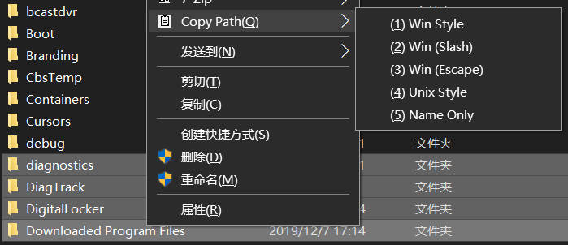

# WinKit
Windows Tools for personal use

## CopyPath:
A shell extension that add items to shell context menu help to copy file or dir path in specific format.
### register:
```bash
# run as admin
regsvr32 CopyPath.dll
```
### unregister:
```bash
# run as admin
regsvr32 /u CopyPath.dll
```


## ErrMsg:
Cmd tool to show text error message. Supports err code returned from GetLastError().
### usage:
```bash
ErrMsg 5
# 5: 拒绝访问。
ErrMsg 1 2
# 1: 函数不正确。
# 2: 系统找不到指定的文件。
```

## IME:
Enable/Disable input method engine or get current status.  
### usage:
Automatically switch ime status when switch between normal and insert mode in Vscode Vim:
```json
{
    "vim.autoSwitchInputMethod.enable": true,
    "vim.autoSwitchInputMethod.defaultIM": "0",
    "vim.autoSwitchInputMethod.obtainIMCmd": "D:\\WinKit\\IME.exe",
    "vim.autoSwitchInputMethod.switchIMCmd": "D:\\WinKit\\IME.exe {im}",
}
```

## ResizeTB
Narrow taskbar, only supports vertical taskbar on left of screen.
### usage:
```bash
.\ResizeTB.exe 30
```


## RM2
remove file/directory to recycle bin
### usage:
```bash
rm2 .\file1.txt .\file2.txt
```